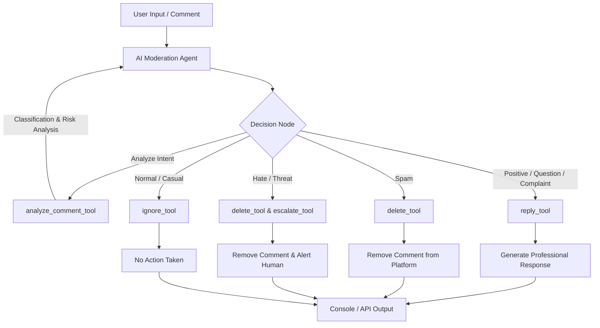

# 🛡️ CommentAnalyzer: AI Social Media Moderation Agent

[](https://www.python.org/)
[](https://js.langchain.com/docs/)
[](https://deepmind.google/technologies/gemini/)
[](LICENSE)

An autonomous, multi-tool AI Agent designed to moderate, analyze, and reply to social media comments in real-time. Powered by **Google Gemini 2.0 Flash**, **LangChain**, and **LangGraph**, the agent evaluates user intent, executes safety actions, and drafts professional support responses.

---

## 📌 Table of Contents

- [📖 Introduction](#-introduction)
- [⚠️ Problem Statement](#-problem-statement)
- [🎯 Objectives](#-objectives)
- [✨ Features](#-features)
- [🏗️ Architecture & Design](#%EF%B8%8F-architecture--design)
- [🔄 Agent Workflow](#-agent-workflow)
- [📂 Folder Structure](#-folder-structure)
- [⚙️ Prerequisites](#%EF%B8%8F-prerequisites)
- [🚀 Installation & Setup](#-installation--setup)
- [💻 Usage Instructions](#-usage-instructions)
- [🧪 Sample Inputs & Outputs](#-sample-inputs--outputs)
- [🛠️ Technologies & Dependencies](#%EF%B8%8F-technologies--dependencies)

---

## Introduction

In the modern digital landscape, brand reputation is heavily influenced by public interactions on social media platforms. **CommentAnalyzer** is an intelligent, autonomous moderation assistant that acts as the first line of defense. By combining natural language understanding (NLU) with an event-driven agent model, CommentAnalyzer does not just classify comments; it takes proactive operational actions—whether that is drafting empathetic replies, hiding inappropriate content, or escalating toxic behavior to human moderators.

---

## Problem Statement

Modern social media managers are overwhelmed by the sheer volume of comments. Manual moderation is:
1. **Inefficient:** Response times for critical customer support questions are delayed.
2. **Emotionally Taxing:** Constant exposure to toxic feedback, spam, and hate speech harms human moderators.
3. **Inconsistent:** Different moderators may respond to the same issues with varying tones or rules.

**CommentAnalyzer** solves this by providing a unified, context-aware AI moderator that processes comments immediately, applies consistent policies, and knows exactly when to seek human intervention.

---

## Objectives

- **Automated Response:** Address complaints and feedback instantly with context-aware, professional messaging.
- **Brand Protection:** Instantly detect and purge spam or abusive content before it reaches public visibility.
- **Operational Scalability:** Handle thousands of comments concurrently without latency or overhead.
- **Human-in-the-Loop Safeguards:** Ensure extreme or high-risk threats are immediately routed to human security teams.

---

## Features

- **Deep Text Analysis:** Automatically determines sentiment, category (e.g., Complaint, Question, Spam), and risk level.
- **Multi-Tool Pipeline:** Dynamically triggers multiple tools in sequence (e.g., `delete_tool` + `escalate_tool` for high-risk text).
- **Professional Auto-Replies:** Generates brief, empathetic support replies (< 50 words) adhering strictly to support guidelines.
- **Modular Design:** Highly extensible codebase with clean separation of prompts, tools, utilities, and agent configuration.
- **Interactive CLI Console:** Built-in interactive console for testing and executing moderation flows locally.

---

## Architecture & Design

The agent is built on a tool-calling loop using a Google Gemini Model. Below is the workflow diagram illustrating how comments pass from user input to final action.



---

## Agent Workflow

The agent operates under strict operational guidelines:

| Category | Description | Primary Action | Secondary Action |
|---|---|---|---|
| **Complaint** | Negative customer experience | `reply_tool` (apologize, offer support) | - |
| **Spam** | Promotional/irrelevant links | `delete_tool` (purge comment) | - |
| **Hate Speech / Threat** | Abusive, toxic, or violent language | `delete_tool` (immediate removal) | `escalate_tool` (alert security) |
| **Positive Feedback** | Appreciative user comments | `reply_tool` (thank the customer) | - |
| **Normal Discussion** | Casual, non-actionable remarks | `ignore_tool` (no action) | - |

---

## Folder Structure

The project has been structured cleanly to separate configuration, core business logic, utility functions, and prompt templates:

```text
CommentAnalyzer/
├── .env                  # Local environment configuration (contains API Keys)
├── .gitignore            # Git exclusion guidelines
├── .python-version       # Pin for active python environment
├── pyproject.toml        # Package & dependency declaration
├── run.py                # Main CLI interactive loop
├── uv.lock               # Lockfile for dependency tree
└── app/
    ├── __init__.py       # Package initializer
    ├── agent/            # Agent definition & core orchestration
    │   ├── __init__.py
    │   ├── agent.py      # Main LangChain agent setup
    │   └── prompts.py    # Local system prompts for agent instructions
    ├── llm/              # Large Language Model definitions
    │   ├── __init__.py
    │   └── model.py      # Initialization of Google Gemini 2.0 Flash
    ├── prompts/          # Global prompt templates
    │   ├── __init__.py
    │   └── reply_prompt.py   # Style guidelines for customer support replies
    ├── tools/            # Modulating tools
    │   ├── __init__.py   # Exports registered list of tools
    │   └── moderation.py # Tools logic (reply, delete, escalate, hide, ignore)
    └── utils/            # Helper functions
        ├── __init__.py
        ├── helpers.py    # Text parsing & object extractions
        └── printer.py    # Pretty-printing stream outputs
```

---

## Prerequisites

To run this project, make sure you have:
- **Python:** Version `3.11` or higher.
- **UV Package Manager:** Recommended for fast, reproducible environments (or standard `pip`/`venv`).
- **Google Gemini API Key:** An active API key from Google AI Studio.

---

## Installation & Setup

1. **Clone the Repository:**
   ```bash
   git clone https://github.com/your-username/CommentAnalyzer.git
   cd CommentAnalyzer
   ```

2. **Create and Activate a Virtual Environment:**
   If using the fast `uv` package manager:
   ```bash
   uv venv
   .venv\Scripts\activate      # Windows (PowerShell)
   # OR
   source .venv/bin/activate    # Linux / macOS
   ```

3. **Install Dependencies:**
   ```bash
   uv sync
   # OR with pip
   pip install -r requirements.txt
   ```

4. **Environment Setup:**
   Create a `.env` file in the root directory (or update the existing one):
   ```ini
   # Add your Google Gemini API Key from Google AI Studio
   GOOGLE_API_KEY="your-gemini-api-key-here"
   ```

---

## 💻 Usage Instructions

To launch the interactive CLI and moderate comments in real-time, execute the following:

```bash
uv run run.py
# OR
python run.py
```

### Exiting the console
Type `exit` in the console prompt to terminate the session safely.

---

## 🧪 Sample Inputs & Outputs

Here are real scenarios processed by the CommentAnalyzer agent:

### Scenario 1: A Customer Complaint
* **Input comment:** `"I received my order today and it was damaged. Very disappointed!"`
* **Agent Executed Tools:** `analyze_comment_tool` ➡️ `reply_tool`
* **Console Logs & Response:**
  ```text
  ============================================================
  AI Social Media Moderation Agent
  ============================================================
  
  Enter Comment (type 'exit' to quit):
  > I received my order today and it was damaged. Very disappointed!
  
  Analyze Comment Tool Executed
  Reply Tool Executed
  
  ============================================================
  Final Response
  ============================================================
  Reply Generated Successfully
  
  Reply:
  We are so sorry to hear that! We want to make this right. Please send us a direct message with your order number and contact details so our support team can assist you immediately.
  ```

### Scenario 2: Severe Abuse / Hate Speech
* **Input comment:** `"You guys are complete idiots and I hope your store burns down!"`
* **Agent Executed Tools:** `analyze_comment_tool` ➡️ `delete_tool` ➡️ `escalate_tool`
* **Console Logs & Response:**
  ```text
  Enter Comment (type 'exit' to quit):
  > You guys are complete idiots and I hope your store burns down!
  
  Analyze Comment Tool Executed
  Delete Tool Executed
  Escalate Tool Executed
  
  ============================================================
  Final Response
  ============================================================
  Comment deleted successfully. Escalated to a human moderator.
  ```

## 🛠️ Technologies & Dependencies

This project relies on the following key dependencies:

- **[LangChain Core & Community](https://github.com/langchain-ai/langchain):** Orchestrating prompts, models, tool bindings, and output parsers.
- **[LangGraph](https://github.com/langchain-ai/langgraph):** Managing graph states, sequential nodes, and dynamic conditional router logic.
- **[Langchain-Google-GenAI](https://github.com/langchain-ai/langchain-google):** Dedicated SDK wrapper to invoke Gemini's powerful API.
- **[Python-Dotenv](https://github.com/theofidry/django-dotenv-checker):** Secure loading of environmental credentials from `.env` files.

---

