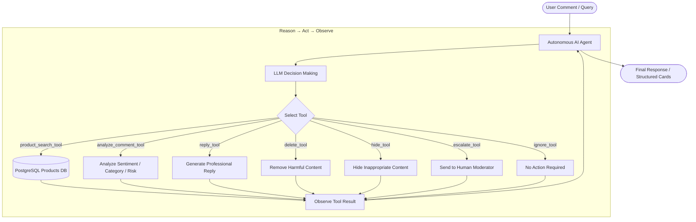

# 🤖 CommentAnalyzer: Autonomous AI Social Media Moderation & Customer Support Agent

[](https://www.python.org/)
[](https://python.langchain.com/)
[-purple.svg)](https://groq.com/)
[](https://www.postgresql.org/)
[](https://streamlit.io/)
[](LICENSE)

**CommentAnalyzer** is a portfolio-grade, autonomous AI Agent designed for real-time social media content moderation, product queries, and customer engagement. Built using **LangChain**, **LangGraph**, **PostgreSQL**, and powered by **Llama 3.3 70B (via Groq)** with an enterprise **Streamlit UI**, the agent dynamically evaluates user intent, queries databases, executes moderation tools, and generates empathetic customer support responses—all without rigid, hardcoded `if/else` conditional logic.

---

## 📌 Table of Contents

- [📖 Project Overview](#-project-overview)
- [🎯 Objectives](#-objectives)
- [✨ Key Features](#-key-features)
- [🧠 Autonomous Agent Architecture](#-autonomous-agent-architecture)
- [🔄 Reason → Act → Observe Workflow](#-reason--act--observe-workflow)
- [🛠️ Tool Ecosystem & Schemas](#%EF%B8%8F-tool-ecosystem--schemas)
- [🖥️ Streamlit Web Dashboard](#%EF%B8%8F-streamlit-web-dashboard)
- [📂 Project Structure](#-project-structure)
- [⚙️ Prerequisites & Installation](#%EF%B8%8F-prerequisites--installation)
- [💻 Usage Instructions](#-usage-instructions)
- [🧪 Example Inputs & Outputs](#-example-inputs--outputs)
- [🚀 Tech Stack & Dependencies](#-tech-stack--dependencies)

---

## Project Overview

In social media management and customer support, traditional systems rely on static keyword blocklists and rigid decision trees. These legacy systems struggle with nuance, sarcasm, complex sentiment, product database integration, and multi-step action planning.

**CommentAnalyzer** addresses this by deploying an **Autonomous ReAct (Reasoning + Acting) Agent**. The agent treats customer support and moderation as an interactive reasoning problem:
1. It analyzes comments and queries contextually.
2. It autonomously determines whether to query product databases or moderate social media content.
3. It selects and invokes appropriate tools dynamically in sequence (e.g., searching PostgreSQL databases, analyzing sentiment, drafting support replies, purging abusive content, or escalating security threats to human moderators).

---

## Objectives

- **Autonomous Decision-Making:** Eliminate hardcoded rules by delegating action selection entirely to LLM-driven reasoning.
- **Dynamic Tool Selection:** Enable multi-tool execution pipelines where the agent decides tool selection and execution order dynamically.
- **Product Database Integration:** Seamlessly search product inventory (price, stock quantity, URL, description) stored in PostgreSQL.
- **Brand Protection & Safety:** Rapidly identify spam, toxic language, and threats to mitigate brand damage in real time.
- **Enterprise Web UI:** Provide a clean Streamlit dashboard featuring live workflow timelines and structured card rendering.

---

## Key Features

- **Zero Hardcoded Logic:** Replaces traditional `if/else` control flow with LLM-guided tool selection.
- **ReAct Execution Cycle:** Follows a continuous Reason → Act → Observe loop to complete multi-stage workflows.
- **PostgreSQL Product Integration:** Performs real-time inventory and pricing lookup via `product_search_tool`.
- **Modern Streamlit Dashboard:** Enterprise UI with real-time workflow tracking (`st.status`), quick sample inputs, product details cards, and moderation response cards.
- **Structured NLU Analysis:** Uses Pydantic schemas to output structured sentiment, category, and risk classifications.
- **High-Speed Inference:** Powered by Groq's LPU infrastructure running Llama 3.3 70B for near-instant response times.

---

## Autonomous Agent Architecture



---

## Reason → Act → Observe Workflow

The agent operates via a 3-stage iterative cycle:

1. **Reason:**
   - The LLM receives the input (comment or query) and inspects available tool descriptions.
   - It formulates an execution plan: e.g. run `product_search_tool` for product questions or `analyze_comment_tool` for social media comments.

2. **Act:**
   - The agent emits tool calls (e.g., `product_search_tool(query="iphone 15")` or `analyze_comment_tool(comment="...")`).
   - Tools run and return structured data to the agent state.

3. **Observe & Iterate:**
   - The agent reads the tool output (*Observation*).
   - Based on observed data, it determines if additional actions are needed (e.g., calling `reply_tool`, `delete_tool`, or `escalate_tool`).

4. **Complete:**
   - The agent synthesizes final output for rendering in CLI or Streamlit structured cards.

---

## Tool Ecosystem & Schemas

### 1. `product_search_tool`
Searches product details in PostgreSQL database matching product name, URL, or ID:
- Returns name, price, currency, stock quantity, availability status, product URL, and description.

### 2. `analyze_comment_tool`
Performs structured analysis on raw comment text using Pydantic validation:
```python
class CommentAnalysis(BaseModel):
    sentiment: str  # Positive, Negative, Neutral
    category: str   # Complaint, Question, Positive Feedback, Spam, Hate Speech, Abuse, Other
    risk_level: str # Low, Medium, High
```

### 3. `reply_tool`
Invokes the LLM with a dedicated customer support prompt template (`REPLY_PROMPT`) to write polite, empathetic responses under 50 words.

### 4. `delete_tool`
Simulates removing harmful or policy-violating comments.

### 5. `hide_tool`
Simulates hiding inappropriate content from public view while preserving records.

### 6. `escalate_tool`
Flags high-risk comments and routes them to human security/moderation teams.

### 7. `ignore_tool`
Explicitly records that no action is required for benign remarks.

---

## 🖥️ Streamlit Web Dashboard

CommentAnalyzer includes a clean, modern **Streamlit UI** (`streamlit_app.py`):

- **Main Inquiry Input:** Input area for social media comments, complaints, or product availability questions.
- **Quick Sample Buttons:** One-click test inputs (e.g. *"is iPhone 15 available?"*, *"my order arrived damaged"*).
- **Workflow Step Timeline:** Live `st.status` visualization showing the 5 agent stages:
  1. `User Input Received`
  2. `Intent Classification & Reasoning`
  3. `Tool Selection` (displays active tool execution)
  4. `Database Search / Comment Analysis`
  5. `Final Response Generated`
- **Structured Cards:**
  - **Product Card:** Displays Name, Price, Stock & Availability, Description, and Link.
  - **Moderation Card:** Displays Category, Sentiment, Risk Level, Action Taken, and Generated Reply.

---

## 📂 Project Structure

```text
CommentAnalyzer/
├── .env                  # Environment variables (GROQ_API_KEY, DB_*)
├── .gitignore            # Version control exclusion rules
├── .python-version       # Python version pin (3.11+)
├── pyproject.toml        # Project dependencies and workspace config
├── README.md             # Project documentation
├── run.py                # CLI interactive agent execution script
├── streamlit_app.py      # Streamlit web dashboard application
├── test_db.py            # Database connection and tool test script
├── uv.lock               # Dependency lockfile
└── app/
    ├── agent/
    │   ├── agent.py      # LangChain / LangGraph agent initialization
    │   └── prompts.py    # Agent system prompt defining reasoning rules
    ├── database/
    │   └── connection.py # PostgreSQL connection manager
    ├── llm/
    │   └── model.py      # Groq LLM configuration (Llama 3.3 70B)
    ├── prompts/
    │   └── reply_prompt.py # Persona prompt for customer support responses
    ├── tools/
    │   ├── __init__.py   # Registered tools list
    │   ├── moderation.py # Moderation tools & schemas
    │   └── product.py    # Database product search tool
    └── utils/
        └── printer.py    # Stream helper for visualizing agent tool execution
```

---

## ⚙️ Prerequisites & Installation

### Prerequisites
- **Python:** Version `3.11` or higher.
- **Package Manager:** `uv` (recommended) or `pip`.
- **Database:** PostgreSQL instance.
- **API Key:** Groq API Key ([Groq Console](https://console.groq.com/)).

### Installation Steps

1. **Clone the Repository:**
   ```bash
   git clone https://github.com/your-username/CommentAnalyzer.git
   cd CommentAnalyzer
   ```

2. **Set Up Virtual Environment & Dependencies:**
   Using `uv`:
   ```bash
   uv venv
   .venv\Scripts\activate      # Windows (PowerShell)
   # OR
   source .venv/bin/activate    # Linux / macOS

   uv sync
   ```

3. **Configure Environment Variables:**
   Create `.env` file in the root directory:
   ```ini
   GROQ_API_KEY="your-groq-api-key"
   DB_HOST="localhost"
   DB_PORT="5432"
   DB_NAME="your_db_name"
   DB_USER="your_db_user"
   DB_PASSWORD="your_db_password"
   ```

---

## 💻 Usage Instructions

### Running the Streamlit Web UI (Recommended)
```bash
uv run streamlit run streamlit_app.py
```

### Running the Terminal CLI
```bash
uv run run.py
```

---

## 🧪 Example Inputs & Outputs

### Scenario 1: Product Query (PostgreSQL Database Search)
**Input:** `"is iPhone 15 available?"`

**Agent Action:** Invokes `product_search_tool`.
**Output Card:**
- **Product Name:** iPhone 15
- **Price:** PKR 250,000.00
- **Stock & Availability:** 100 units (In Stock)
- **Description:** Apple iPhone 15 128GB latest model

---

### Scenario 2: Customer Complaint
**Input:** `"My package was delivered damaged and two days late! Unsatisfied with this."`

**Agent Action:** Invokes `analyze_comment_tool` and `reply_tool`.
**Output Card:**
- **Category / Intent:** Complaint
- **Sentiment:** Negative
- **Risk Level:** Medium
- **Action Taken:** REPLY GENERATED
- **Reply:** We sincerely apologize for the delay and damaged package. Please contact our support team with your order number to arrange a replacement immediately.

---

## 🚀 Tech Stack & Dependencies

- **[LangChain](https://github.com/langchain-ai/langchain):** Framework for agent logic, prompts, and tools.
- **[LangGraph](https://github.com/langchain-ai/langgraph):** Workflow engine for state management.
- **[Streamlit](https://streamlit.io/):** Web application framework.
- **[PostgreSQL / psycopg2](https://www.postgresql.org/):** Database backend for product query search.
- **[Groq LLM](https://groq.com/):** Ultra-fast inference engine running Llama 3.3 70B.
- **[UV](https://github.com/astral-sh/uv):** Package manager.
