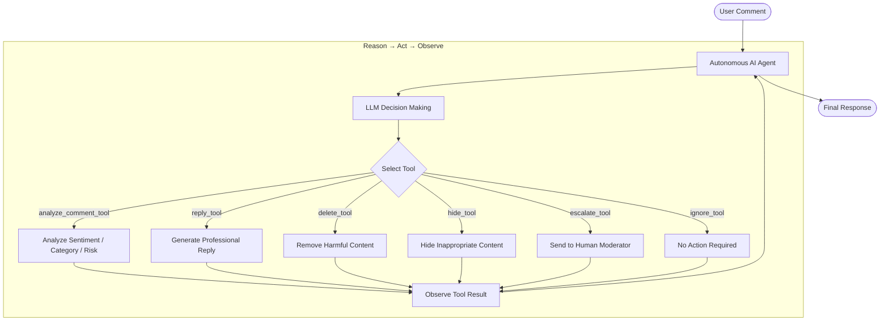

# 🤖 CommentAnalyzer: Autonomous AI Social Media Moderation Agent

[](https://www.python.org/)
[](https://python.langchain.com/)
[-purple.svg)](https://groq.com/)
[]()
[](LICENSE)

**CommentAnalyzer** is a portfolio-grade, autonomous AI Agent designed for real-time social media content moderation and customer engagement. Built using **LangChain**, **LangGraph**, and powered by **Llama 3.3 70B (via Groq)**, the agent dynamically evaluates user intent, selects and executes moderation tools, and generates empathetic customer support responses—all without rigid, hardcoded `if/else` conditional logic.

---

## 📌 Table of Contents

- [📖 Project Overview](#-project-overview)
- [🎯 Objectives](#-objectives)
- [✨ Key Features](#-key-features)
- [🧠 Autonomous Agent Architecture](#-autonomous-agent-architecture)
- [🔄 Reason → Act → Observe Workflow](#-reason--act--observe-workflow)
- [🛠️ Tool Ecosystem & Schemas](#%EF%B8%8F-tool-ecosystem--schemas)
- [📂 Project Structure](#-project-structure)
- [⚙️ Prerequisites & Installation](#%EF%B8%8F-prerequisites--installation)
- [💻 Usage Instructions](#-usage-instructions)
- [🧪 Example Inputs & Outputs](#-example-inputs--outputs)
- [🚀 Tech Stack & Dependencies](#-tech-stack--dependencies)

---

## Project Overview

In social media management, traditional moderation systems rely on static keyword blocklists and rigid decision trees. These legacy systems struggle with nuance, sarcasm, complex sentiment, and multi-step action planning.

**CommentAnalyzer** addresses this by deploying an **Autonomous ReAct (Reasoning + Acting) Agent**. The agent treats moderation as an interactive reasoning problem:
1. It analyzes comments contextually using structured NLU output.
2. It autonomously determines which actions to take based on high-level operational guidelines.
3. It selects and invokes appropriate tools dynamically in sequence (e.g., analyzing sentiment, drafting support replies, purging abusive content, or escalating security threats to human moderators).

---

## Objectives

- **Autonomous Decision-Making:** Eliminate hardcoded rules by delegating action selection entirely to LLM-driven reasoning.
- **Dynamic Tool Selection:** Enable multi-tool execution pipelines where the agent decides tool selection and execution order dynamically.
- **Brand Protection & Safety:** Rapidly identify spam, toxic language, and threats to mitigate brand damage in real time.
- **Contextual Customer Engagement:** Automatically draft empathetic, brand-aligned responses (< 50 words) to customer inquiries and complaints.
- **Human-in-the-Loop Integration:** Seamlessly route critical or high-risk incidents to human moderation teams.

---

## Key Features

- **Zero Hardcoded Logic:** Replaces traditional `if/else` control flow with LLM-guided tool selection.
- **ReAct Execution Cycle:** Follows a continuous Reason → Act → Observe loop to complete multi-stage workflows.
- **Structured NLU Analysis:** Uses Pydantic schemas to output structured sentiment, category, and risk classifications.
- **High-Speed Inference:** Powered by Groq's LPU infrastructure running Llama 3.3 70B for near-instant response times.
- **Modular Tool Architecture:** Encapsulates moderation operations (`analyze`, `reply`, `delete`, `hide`, `escalate`, `ignore`) into clean, reusable LangChain tools.
- **Interactive CLI Console:** Built-in streaming terminal interface showing live agent thought processes and tool execution steps.

---

## Autonomous Agent Architecture

Unlike deterministic scripts, CommentAnalyzer runs inside an agentic runtime loop. The agent evaluates system instructions, tool descriptions, and user input to determine its execution path dynamically.



---

## Reason → Act → Observe Workflow

The agent operates via a 3-stage iterative cycle:

1. **Reason:**
   - The LLM receives the input comment and inspects available tool descriptions.
   - It formulates an execution plan: first run `analyze_comment_tool` to establish sentiment, category, and risk level.

2. **Act:**
   - The agent emits a tool call (e.g., `analyze_comment_tool(comment="...")`).
   - The tool runs and returns structured JSON context to the agent state.

3. **Observe & Iterate:**
   - The agent reads the tool output (*Observation*).
   - Based on the observed risk and category, it decides whether another tool is required:
     - **Complaint / Positive Feedback:** Calls `reply_tool` to generate a professional support message.
     - **Spam:** Calls `delete_tool` to remove the post.
     - **Hate Speech / Threat:** Calls `delete_tool` followed by `escalate_tool`.
     - **Normal / Casual:** Calls `ignore_tool`.

4. **Complete:**
   - Once all necessary actions are observed, the agent synthesizes the results and outputs a standardized summary containing the analysis breakdown and executed actions.

---

## Tool Ecosystem & Schemas

### 1. `analyze_comment_tool`
Performs structured analysis on the raw comment text using Pydantic validation:
```python
class CommentAnalysis(BaseModel):
    sentiment: str  # Positive, Negative, Neutral
    category: str   # Complaint, Question, Positive Feedback, Spam, Hate Speech, Abuse, Other
    risk_level: str # Low, Medium, High
```

### 2. `reply_tool`
Invokes the LLM with a dedicated customer support prompt template (`REPLY_PROMPT`) to write polite, empathetic responses under 50 words.

### 3. `delete_tool`
Simulates removing harmful or policy-violating comments from the social platform.

### 4. `hide_tool`
Simulates hiding inappropriate content from public view while preserving records.

### 5. `escalate_tool`
Flags high-risk comments (threats, severe abuse) and routes them to human security/moderation teams.

### 6. `ignore_tool`
Explicitly records that no action is required for benign, non-actionable remarks.

---

## 📂 Project Structure

```text
CommentAnalyzer/
├── .env                  # Environment variables (GROQ_API_KEY)
├── .gitignore            # Version control exclusion rules
├── .python-version       # Python version pin (3.11+)
├── pyproject.toml        # Project dependencies and workspace config
├── README.md             # Project documentation
├── run.py                # Main CLI interactive agent execution script
├── uv.lock               # Deterministic dependency lockfile
└── app/
    ├── __init__.py
    ├── agent/
    │   ├── __init__.py
    │   ├── agent.py      # LangChain agent initialization (create_agent)
    │   └── prompts.py    # Agent system prompt defining reasoning rules
    ├── llm/
    │   ├── __init__.py
    │   └── model.py      # Groq LLM model configuration (Llama 3.3 70B)
    ├── prompts/
    │   ├── __init__.py
    │   └── reply_prompt.py # Persona prompt for customer support responses
    ├── tools/
    │   ├── __init__.py   # Registered tools export list
    │   └── moderation.py # Custom tool definitions & Pydantic schemas
    └── utils/
        ├── __init__.py
        └── printer.py    # Stream helper for visualizing agent tool execution
```

---

## ⚙️ Prerequisites & Installation

### Prerequisites
- **Python:** Version `3.11` or higher.
- **Package Manager:** `uv` (recommended for ultra-fast setup) or standard `pip`.
- **API Key:** Groq API Key (obtain from [Groq Console](https://console.groq.com/)).

### Installation Steps

1. **Clone the Repository:**
   ```bash
   git clone https://github.com/your-username/CommentAnalyzer.git
   cd CommentAnalyzer
   ```

2. **Set Up Virtual Environment & Dependencies:**
   Using `uv`:
   ```bash
   uv venv
   .venv\Scripts\activate      # Windows (PowerShell)
   # OR
   source .venv/bin/activate    # Linux / macOS

   uv sync
   ```

   *Alternatively, using standard `pip`:*
   ```bash
   python -m venv .venv
   source .venv/bin/activate   # Linux / macOS
   pip install -e .
   ```

3. **Configure Environment Variables:**
   Create a `.env` file in the root directory:
   ```ini
   GROQ_API_KEY="your-groq-api-key-here"
   ```

---

## 💻 Usage Instructions

Run the interactive CLI loop using `uv`:

```bash
uv run run.py
```

*Or using python directly:*
```bash
python run.py
```

### Terminating the Console
Type `exit` at the interactive prompt to quit the application.

---

## 🧪 Example Inputs & Outputs

### Scenario 1: Positive Customer Feedback
**Input:** `"Amazing Service"`

**Agent Execution Stream:**
```text
============================================================
AI Social Media Moderation Agent
============================================================

Enter Comment (type 'exit' to quit):
> Amazing Service

============================================================
Agent Streaming Progress
============================================================

🔧 Calling: analyze_comment_tool
Analyze Comment Tool Executed

🔧 Calling: reply_tool
Reply Tool Executed

============================================================
Final Response
============================================================
Analysis:
- Intent: Positive Feedback
- Severity: Low
- Recommended action: Reply

Reply:
Thank you so much! We're glad you had a great experience with us.
```

---

### Scenario 2: Customer Complaint
**Input:** `"My package was delivered damaged and two days late! Unsatisfied with this."`

**Agent Execution Stream:**
```text
Enter Comment (type 'exit' to quit):
> My package was delivered damaged and two days late! Unsatisfied with this.

============================================================
Agent Streaming Progress
============================================================

🔧 Calling: analyze_comment_tool
Analyze Comment Tool Executed

🔧 Calling: reply_tool
Reply Tool Executed

============================================================
Final Response
============================================================
Analysis:
- Intent: Complaint
- Severity: Medium
- Recommended action: Reply

Reply:
We sincerely apologize for the delay and the damaged package. Please reach out to our support team with your order number so we can arrange a replacement right away.
```
---
## Tech Stack & Dependencies

- **[LangChain](https://github.com/langchain-ai/langchain):** Agent framework, prompt templates, tool bindings, and state management.
- **[LangGraph](https://github.com/langchain-ai/langgraph):** Agentic graph workflow and tool execution loop.
- **[LangChain Groq](https://github.com/langchain-ai/langchain-groq):** High-speed LLM integration utilizing Llama 3.3 70B.
- **[Pydantic v2](https://docs.pydantic.dev/):** Data parsing and validation for structured NLU outputs.
- **[Python-Dotenv](https://github.com/theofidry/django-dotenv-checker):** Environment variable loading.
- **[UV](https://github.com/astral-sh/uv):** Fast Python package manager and project environment management.
